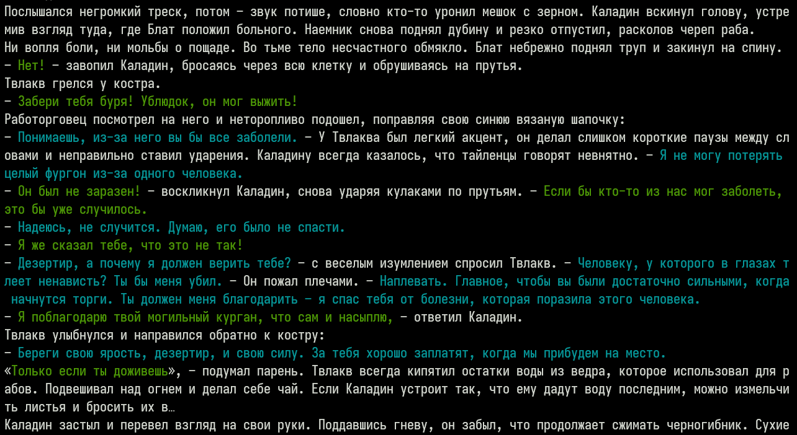

## Text-To-Conversation toolkit (TTC)

This NLP library can help you with:

- Extraction of characters' replicas from literary texts;
- Identification of the actors owning these replicas.

### Demo (CLI)



### Progress

We aim to achieve the following goals:

- Better accuracy on the actor classification task
  (it is near 80% or worse for now);
- Support for more languages
  (only Russian is supported at the moment).

### Installation

Install with pip is just a usual `pip install .` from the project dir.

### Usage

**As a library**

You can find an example of using the library in the [`cli.py`](ttc/cli.py) file.

**As a tool for the CLI**

Test output on a text file:

```console
ttc print-play path-to-the-text-file text-language
```

**Notes**

- Text must be encoded in UTF-8;
- Text must be sanitized (see https://github.com/F1uctus/ttc/issues/23);
- It is usually better to test on some middle-sized text (e.g a book chapter);
- Supported `text-language`s are:
    + ru (russian)

### Development

Please install [Poetry](https://python-poetry.org).

Spawn a new virtual environment for the project:

```console
poetry shell
```

Install project dependencies:

```console
poetry install [--with dev,large_models_ru]
```

Contributions are very welcome!

#### Implementation notes

[russian/*/speaker_classifier.py](ttc/language/russian/pipelines/speaker_classifier.py):

